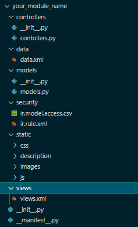

# Odoo_module_scaffolding
 The file helps generate custom module with all the files needed for the  modules

# How to use 
 copy the file in the location folder and use the terminal/commandline to run it.
    '''
    python odoo_modules_scafold.py your_module_name
    '''
    <pre>
    ```bash
    $ python odoo_modules_scafold.py your_module_name
    ```
    </pre>

# Sample output 


# Info
Feel free to modify it to fit your usecase improve it


